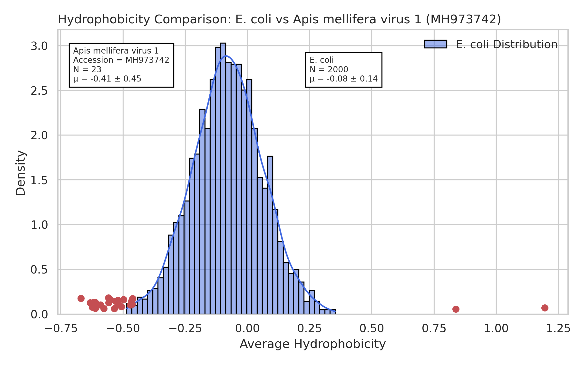
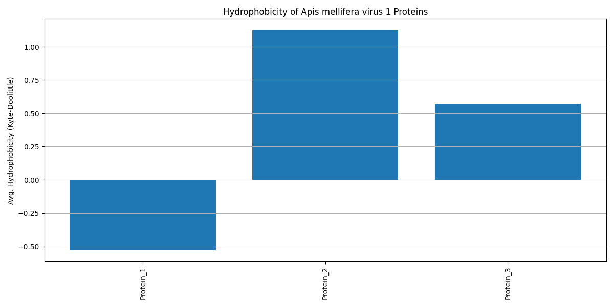
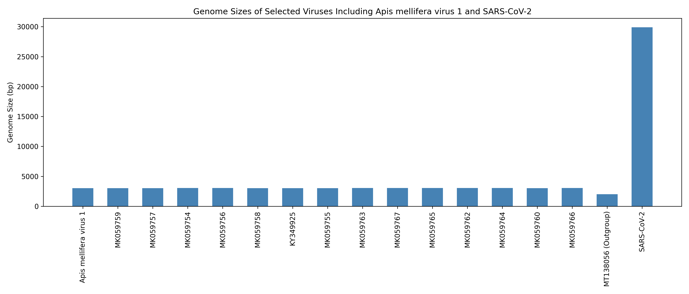

# Final Project: Apis mellifera virus 1

**Author:** Arnav Earve  
**Date:** 5/5/25
**Accession Number:** MH973742  

---

## I. Introduction

Apis mellifera virus 1 is a DNA virus in the genus Torbevirus, and the family Redondoviridae. The ICTV classification is:  
- **Realm:** Monodnaviria  
- **Kingdom:** Shotokuvirae  
- **Phylum:** Cressdnaviricota  
- **Class:** Arfiviricetes  
- **Order:** Recrevirales  
- **Family:** Redondoviridae  
- **Genus:** Torbevirus  
- **Species:** Torbevirus brisa

- Baltimore classification: The Baltimore classification of the virus is class II, because it is a single stranded DNA [1](#ref1).
- Physical size: The physical size of Apis mellifera virus 1 is approximately 30 nm, which is smaller than a typical human cell (~10,000 nm) and smaller than SARS-CoV-2 (~120 nm) [3](#ref3).
- Shape and envelope: The virus exhibits a icosahedral, a more smaller circular shape, morphology and does not posses an envelope which is similar to other viruses of the same family [5](#ref5).
- Discovery and outbreaks: Apis mellifera virus 1 was first described in 2019 by accident when scientists were trying to find a different virus of the same family [4](#ref4). There haven't been any prominent outbreaks of the virus which may lead to why there aren't many known facts and research done on this virus. The Redondoviridae family as a whole is fairly new with many viruses still being researched in the more early stages.
- Host range: This virus infects Apis mellifera, more commonly known as the western honey bee and is host specfic virus because it has only been found with bees [5](#ref5).
- Cell entry: The virus penetrates the host cell via the endocytoic pathway like many other non enveloped viruses. This is the best way for the virus to get to the host cell, with the help of using virus receptors [4](#ref4).
- Replication strategy: Apis mellifera virus 1 relies on host machinery and replicates by hijacking the host and relying on its replication enzymes. Once the virus hijacks the host, it then uses the DNA polymerase to turn DNA into double-stranded DNA [1](#ref1).
- Release mechanism: Viral proteins are released by apoptosis, a process in which the host cell is killed, common among non-enveloped viruses and other viruses within the same family and genus [6](#ref6).
- Latency: The virus does not show any signs of latency, similar to many non-enveloped viruses [6](#ref6)).
- Equilibrium and antigenic shift: The virus is not considered in equilibrium with humans, due to the fact the virus has only been known to effect bees. It also does not show any antigenic shift, for the same reason. Since it's only found in bees and doesn't change shift any to different hosts, it doesn't have any antigenic shift [7](#ref7).
- Vaccines: There are no current vaccines for Apis Mellifera virus 1. Since it was only discovered in 2019, with no prominent outbreaks since then, and it hasn't spread to humans yet with any known diseases there haven't been any vaccines created yet. If there is a major outbreak, or the threat for this virus increases then we’ll have more research towards the virus and potentially a vaccine [7](#ref7).
- Antiviral drugs: There aren't any known antiviral drugs for this virus. As the honeybee is infected more and more it becomes heavily agressive until it eventually dies [2](#ref2).


---

## II. Methods
1. First, I downloaded the viral sequence by accession number of MH973742 , and selected 3 close relatives to identify a most recent common ancesstor. The code I used to achieve this is listed below. I got the accession number from the spreadsheet document. 

```python
accession_codes = [
    "MH973742", "MK059759", "MK059757", "MK059754", "MK059756",
    "MK059758", "KY349925", "MK059755", "MK059763", "MK059767",
    "MK059765", "MK059762", "MK059764", "MK059760", "MK059766",
    "MT138056", "NC_045512.2", "ON677309", "MZ710935", "MW881235",
    "KJ647417"
``` 

2. The next step for my methods was to find open reading frames longer than 300bp, while making sure to determine the correct start and stop codons of the virus. Doing this helps with getting better and more functional proteins.  The code to achieve is this below. Once my code finished running I made sure to export the proteome file.

```python
   from Bio import SeqIO
from Bio.SeqRecord import SeqRecord

def find_orfs(seq, min_len=300):
    orfs = []
    count = 1
    for strand, nuc in [(+1, seq), (-1, seq.reverse_complement())]:
        for frame in range(3):
            trans = nuc[frame:].translate(to_stop=False)
            aa_start = 0
            for aa_end in range(len(trans)):
                if trans[aa_end] == "*":
                    length = (aa_end - aa_start) * 3
                    if length >= min_len:
                        orf_seq = trans[aa_start:aa_end]
                        desc = f"{strand} strand, frame {frame}"
                        orfs.append(SeqRecord(orf_seq, id=f"Protein_{count}", description=desc))
                        count += 1
                    aa_start = aa_end + 1
    return orfs

record = SeqIO.read("MH973742.fasta", "fasta")
orfs = find_orfs(record.seq)
SeqIO.write(orfs, "MH973742_proteome.fasta", "fasta")
```

3. I then selected 15 viruses from the same genus, two additional viruses in a different genus but the same family, and 1 outgroup from a different family in the same order. I wasn't able to select five additional viruses in a different genus but the same family because only two viruses fit the crteria that was needed. It's important to get different viruses because it allows to get more accurate data because of your broader input. In this specific case multiple viruses from the same genus helps with a more accurate answer for finding the top 3 cloest relative to Apis mellifera virus 1.
4. Then I formatted an accession code object and used the `calculate_sequence_lengths` function to output the lengths of all your downloaded genomes. This was an important step because it helps us ensure an accurate dataset. The code to achieve is this below.

```python
   from Bio import SeqIO

def calculate_sequence_lengths(fasta_file, accession_codes):
    seq_lengths = {}
    for record in SeqIO.parse(fasta_file, "fasta"):
        if record.id in accession_codes:
            seq_lengths[record.id] = len(record.seq)
    print("Genome Lengths:")
    for acc in accession_codes:
        length = seq_lengths.get(acc, "Not found")
        print(f"{acc}: {length} bp")
```


5. Used a MAFFT SLURM script to align all sequences. The alignment that we got was then used to create a phylogenetic tree. The code to achieve is this below.

```python
    #!/bin/bash
#SBATCH --job-name=mafft_align
#SBATCH --output=mafft_output.txt
#SBATCH --error=mafft_error.txt
#SBATCH --partition=Centaurus
#SBATCH --ntasks=1
#SBATCH --time=00:10:00

module load mafft/7.525woe
mafft --auto all_sequences.fasta > all_sequences_aligned.fasta
```

6. Constructed a phylogenetic tree using IQ-TREE with model selection and added bootstrap values. When using IQ-TREE itself I made sure to make it look nice by ordering the nodes, increasing tip label size. The code to achieve is this below.

```python
   #!/bin/bash
#SBATCH --job-name=iqtree_phylogeny
#SBATCH --output=iqtree_output.txt
#SBATCH --error=iqtree_error.txt
#SBATCH --partition=Centaurus
#SBATCH --ntasks=1
#SBATCH --time=00:15:00

module load iqtree
iqtree -s all_sequences_aligned.fasta -m TEST -bb 1000
```

---

## III. Results and Discussion

### Hydrophobicity Plot  
I generated this plot against the E.coli proteome resulting in the hydrophobicity for the E.coli being near 0 and -0.25. However, for the Apis mellifera virus we can see that it its hydrophobicity is lower than the average for E.coli. The offical average for E.coli was -0.08 comapared to -0.41 for Apis mellifera. There are 23 points plotted for the Apis virus comapred to the 2000 for E.coli. In simple this graph is just for comparsion between Apis mellifera virus and E.coli when speaking about hydrophobicity. The code I used to create this plot is down below.

```python
from Bio import SeqIO
import matplotlib.pyplot as plt

kd = {'A': 1.8, 'C': 2.5, 'D': -3.5, 'E': -3.5, 'F': 2.8,
      'G': -0.4, 'H': -3.2, 'I': 4.5, 'K': -3.9, 'L': 3.8,
      'M': 1.9, 'N': -3.5, 'P': -1.6, 'Q': -3.5, 'R': -4.5,
      'S': -0.8, 'T': -0.7, 'V': 4.2, 'W': -0.9, 'Y': -1.3}

def avg_hydro(seq): return sum(kd.get(aa, 0) for aa in seq) / len(seq)

records = list(SeqIO.parse("MH973742_proteome.fasta", "fasta"))
scores = [avg_hydro(str(r.seq)) for r in records]
names = [r.id for r in records]

plt.bar(names, scores)
plt.xticks(rotation=90)
plt.ylabel("Avg. Hydrophobicity")
plt.title("Hydrophobicity of AMV-1 Proteins")
plt.tight_layout()
plt.savefig("hydrophobicity_plot.png")
plt.show()
```



### BLAST of Outlier Protein  
Protein 2 was my outlier protein because it had a significantly better hydrophobicity. Another reason I selected this protein is due to the fact that with a higher hydrophobicity it's more likely to be used in processes like replication and cell entry. I then blasted protein two and the sequence that was annotated was cited as being involved with viral entry mechanisms. I also blasted protein one because it has the lowest hydrophobicity just to compare the two and see the difference. By blasting the second protein we proved that idea of it being used for important process for the virus such as viral entry. By blasting the first protein we proved the idea that it isn't really useful when regarding on vital entry's or processes a virus may need. 


### Genome Size Plot  
The genome size of Apis mellifera virus 1 is 3033 bp. I compared this with 15 related viruses, two different viruses and the virus. Most genomes were around the same of 3000 bp, with the outgroup (MT138056) being smaller at 2015 bp. Also, compared to the Sar-CoV-2 virus, Apis mellifera is significantly smaller by almost 25,000 bp. The fact that most of the genomes were around the same number of base pairs shows how consistent these genomes are between viruses of the same family. Also, the genome size plot helped show how far from the rest of the group virus MT138056 was. The code I used to create this plot is down below. 

```python
import matplotlib.pyplot as plt
genome_lengths = {
    'MH973742': 3033,
    'MK059759': 3030,
    'MK059757': 3026,
    'MK059754': 3049,
    'MK059756': 3050,
    'MK059758': 3034,
    'KY349925': 3019,
    'MK059755': 3023,
    'MK059763': 3056,
    'MK059767': 3051,
    'MK059765': 3051,
    'MK059762': 3054,
    'MK059764': 3050,
    'MK059760': 3043,
    'MK059766': 3052,
    'MT138056': 2015  # Outgroup
}

plt.figure(figsize=(12, 6))
plt.bar(genome_lengths.keys(), genome_lengths.values())
plt.xticks(rotation=90)
plt.ylabel("Genome Size (bp)")
plt.title("Genome Sizes of AMV-1 and Related Viruses")
plt.tight_layout()
plt.savefig("genome_size_plot.png")
plt.show()
```



### Phylogeny and Model  
Using FigTree, the tree was rooted to MT138056, with ordered nodes and increasing the tip label size. The closest relatives of MH973742 were MK059759, MK059755, and MK059758. The  best fit model used to infer this phylogeny was the Kimura 2-Parameter model because I was comparing the virus the other closely related viruses, which is what excels at. If I were to use more unqiue and different viruses I would of had to use a different model. Based on the results there is no evidence that the host switch had happened, which is why the virus does not have any angetic shifts. Across the graph we have high bootstrap values which suggests the branches are well supported by these values. The tree created was important because not only did I find the cloest relatives for the virus but, was able to compare all 18 viruses with each other. 


---

## IV. Plots

### Hydrophobicity Plot  


### Genome Size Plot  


### Phylogeny Tree  
(


## V. References

# References Cited

<a id="ref1"></a>1. De Miranda, Joachim R., et al. *Standard methods for virus research in Apis mellifera.* Journal of Apicultural Research 52.4 (2013): 1–56.  
<a id="ref2"></a>2. Tantillo, Giuseppina, et al. *Virus infections of honeybees Apis mellifera.* Italian Journal of Food Safety 4.3 (2015): 5364.  
<a id="ref3"></a>3. Lanzi, Gaetana, et al. *Molecular and biological characterization of deformed wing virus of honeybees.* Journal of Virology 80.10 (2006): 4998–5009.  
<a id="ref4"></a>4. Noël, Amélie, Yves Le Conte, and Fanny Mondet. *Varroa destructor: how does it harm Apis mellifera honey bees and what can be done about it?* Emerging Topics in Life Sciences 4.1 (2020): 45–57.  
<a id="ref5"></a>5. Kraberger, Simona, et al. *Diverse single-stranded DNA viruses associated with honey bees (Apis mellifera).* Infection, Genetics and Evolution 71 (2019): 179–188.  
<a id="ref6"></a>6. Chen, Yanping, Jeffery S. Pettis, and Mark F. Feldlaufer. *Detection of multiple viruses in queens of the honey bee Apis mellifera L.* Journal of Invertebrate Pathology 90.2 (2005): 118–121.  
<a id="ref7"></a>7. Beaurepaire, Alexis, et al. *Diversity and global distribution of viruses of the western honey bee, Apis mellifera.* Insects 11.4 (2020): 239.
